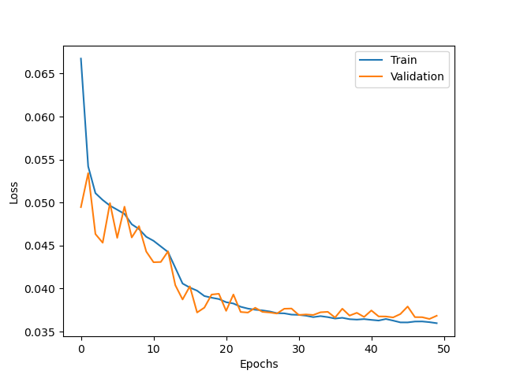
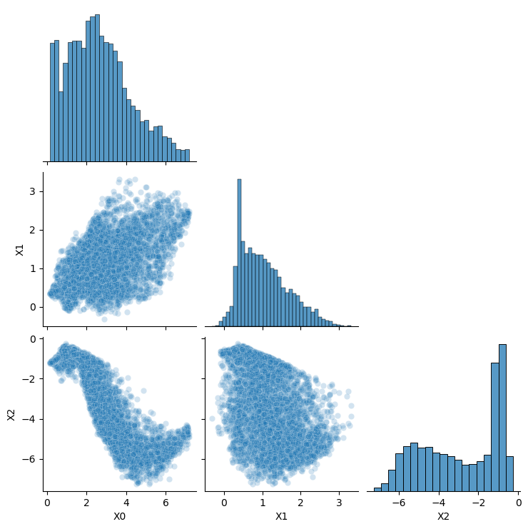
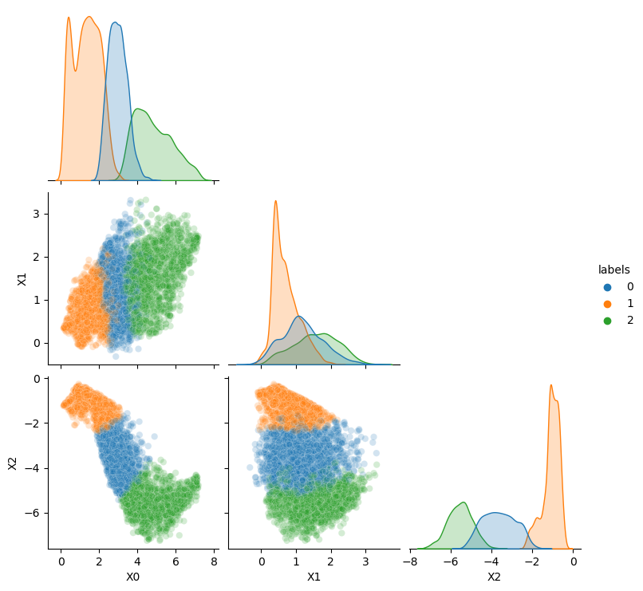

# Semi-supervised Image Classification

## Workflow
  - Train the autoencoder: `python trainAutoencoder.py`
  - Create low dimensional representation: `python predictAutoencoder.py <checkpoint file>`
  - Create clusters: `python classify.py`<algorithm>`
  - Check the images in each cluster: `python viewResults.py`

## Current State
### Reconstruction Loss on Autoencoder

### Latent Space Distribution

### Latent Space Clusters

